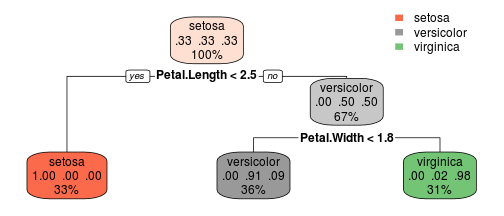

## Predicting Iris Species

* Created app that predicts Iris species using petal length and width
* Using decision tree model to fit data
* Give most likely species and probability

--- .class #id 

## Model fit

Model is first fitted with dataset iris


```
## n= 150 
## 
## node), split, n, loss, yval, (yprob)
##       * denotes terminal node
## 
## 1) root 150 100 setosa (0.33333333 0.33333333 0.33333333)  
##   2) Petal.Length< 2.45 50   0 setosa (1.00000000 0.00000000 0.00000000) *
##   3) Petal.Length>=2.45 100  50 versicolor (0.00000000 0.50000000 0.50000000)  
##     6) Petal.Width< 1.75 54   5 versicolor (0.00000000 0.90740741 0.09259259) *
##     7) Petal.Width>=1.75 46   1 virginica (0.00000000 0.02173913 0.97826087) *
```

--- .class #id 


## Example

For example, if petal length is 3 cm and petal width is 1cm, it outputs the splitting criteria and prediction



```
##          1 
## versicolor 
## Levels: setosa versicolor virginica
```

```
##   setosa versicolor  virginica
## 1      0  0.9074074 0.09259259
```

--- .class #id

## The End

Thanks for your time. Shiny code can be found in 


https://github.com/lukeyanchen/DevelopingDataProducts
