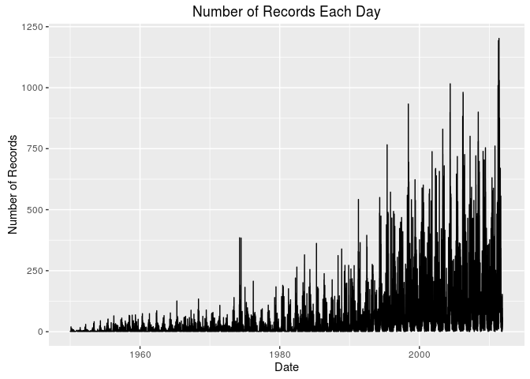
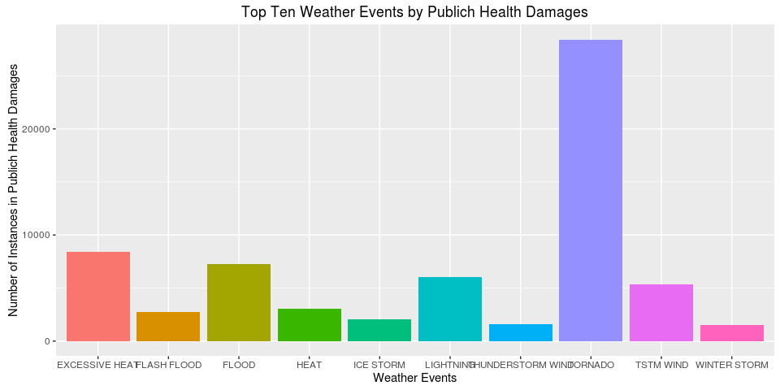
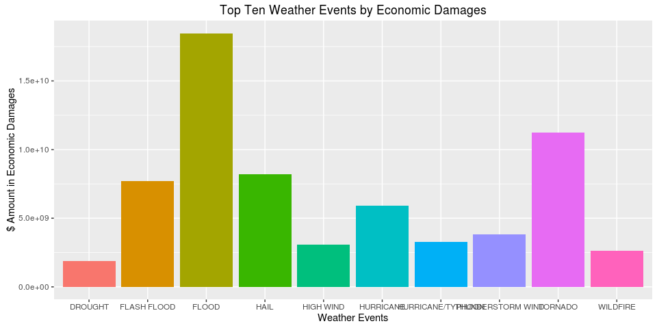

# Analyzing the Public Health and Economical Effects Due to Weather Events


## Synopsis

This is an analysis on the Storm Data collected by the U.S. National Oceanic and Atmospheric Administration's (NOAA). In this analysis, we will attempt to identify which type of weather event is most harmful to public health and causes the most economic loss and damage and list the top ten weather events for each of the categories.

We have also identified that **TORNADO** causes the most injuries and fatalities while **FLOOD** causes the most property and crop damage.

We further extend our analysis by splitting the results by states to list the most desctructive event for each state.

## 1. Data Processing
Data was downloaded [here](https://d396qusza40orc.cloudfront.net/repdata%2Fdata%2FStormData.csv.bz2) in the form of a bz2 file and was decompressed and read.

### 1.1 Reading and Pruning Data

Firstly, we read the data and then we have to convert the date into something useable. Next, we plot the number of observations per day and we see that due to the lack of records before 1990, we are going to records before 1990 to get a better representation. We also go ahead and choose only the columns we are interested in:

* `BGN_DATE` Begin date
* `STATE` State, 2 letter abbreviation
* `EVTYPE` Type of event
* `LENGTH` Length of tornado path
* `WIDTH` Maximum width of tornado's path
* `F` Fujita tornado intensity scale
* `MAG` Hail in inches
* `FATALITIES` Number of fatalities
* `INJURIES` Number of injuries
* `PROPDMG` Property damage in dollars
* `PROPDMGEXP` K=thousands, M=millions, B=billions
* `CROPDMG` Crop damage in dollars
* `CROPDMGEXP` H=hundreds, K=thousands, M=millions, B=billions


```r
library(plyr)
library(ggplot2)
library(R.utils)
options(scipen = 999)

bunzip2("repdata-data-StormData.csv.bz2", "repdata-data-StormData.csv", remove = FALSE, skip = TRUE)
```

```
## [1] "repdata-data-StormData.csv"
## attr(,"temporary")
## [1] FALSE
```

```r
data<-read.csv("repdata-data-StormData.csv")
data$BGN_DATE<-as.Date(strptime(as.character(data$BGN_DATE),format='%m/%d/%Y %H:%M:%S'))
y<-count(data,"BGN_DATE")
ggplot(y,aes(BGN_DATE,freq))+geom_line()+xlab("Date")+ylab("Number of Records")+ggtitle("Number of Records Each Day")
```

<!-- -->

```r
#Selecting variables and removing records before 1990
myvars <- c("BGN_DATE", "STATE", "EVTYPE","LENGTH","WIDTH","F","MAG","FATALITIES","INJURIES","PROPDMG","PROPDMGEXP","CROPDMG","CROPDMGEXP")
data_small <- data[myvars]
data_small <- data_small[which(data_small$BGN_DATE>=as.Date("1990-01-01")),]
```


### 1.2 Data Transformation

We then transform `PROPDMG` and `CROPDMG` into common denominators by applying `PROPDMGEXP` and `CROPDMGEXP` to them so that we have the actual dollar amount. For convenience, we also add them up to form a new column `TOTALECONDMG` and add `FATALITIES` and `INJURIES` (assuming equal weightage) to form a new column `PUBLICHEALTHDMG`. 


```r
data_small$PROPDMGEXP_2[data_small$PROPDMGEXP %in% c("K")] <- 1000
data_small$PROPDMGEXP_2[data_small$PROPDMGEXP %in% c("M")] <- 1000000
data_small$PROPDMGEXP_2[is.na(data_small$PROPDMGEXP)] <- 1

data_small$CROPDMGEXP_2[data_small$CROPDMGEXP %in% c("K")] <- 1000
data_small$CROPDMGEXP_2[data_small$CROPDMGEXP %in% c("M")] <- 1000000
data_small$CROPDMGEXP_2[is.na(data_small$CROPDMGEXP)] <- 1

data_small$TOTALECONDMG<-data_small$PROPDMG*data_small$PROPDMGEXP_2+data_small$CROPDMG*data_small$CROPDMGEXP_2
data_small$PUBLICHEALTHDMG<-data_small$FATALITIES+data_small$INJURIES
```

## 2. Results
### 2.1 Which Causes Most in Public Health Damages?

Finally, we aggregate the data by number of public health damages for each weather event and find the top 10 events.


```r
data_events<-aggregate(PUBLICHEALTHDMG~EVTYPE,data_small,FUN="sum")
topten<-head(arrange(data_events,desc(PUBLICHEALTHDMG)),10)
ggplot(data=topten, aes(x=EVTYPE, y=PUBLICHEALTHDMG, fill=EVTYPE)) +
    geom_bar(stat="identity")+ guides(fill=FALSE)+ggtitle("Top Ten Weather Events by Publich Health Damages") +xlab("Weather Events")+ylab("Number of Instances in Publich Health Damages")
```

<!-- -->

### 2.2 Which Causes Most in Economic Damages?

Also, we take a look at the top 10 events which contributed the most economic damages.


```r
data_events<-aggregate(TOTALECONDMG~EVTYPE,data_small,FUN="sum")
topten<-head(arrange(data_events,desc(TOTALECONDMG)),10)
ggplot(data=topten, aes(x=EVTYPE, y=TOTALECONDMG, fill=EVTYPE)) +
    geom_bar(stat="identity")+ guides(fill=FALSE)+ggtitle("Top Ten Weather Events by Economic Damages") +xlab("Weather Events")+ylab("$ Amount in Economic Damages")
```

<!-- -->

### 2.3 What About For Each State?
Obviously, the situation is different for each state. **TORNADO** might not be the most devasting to say `WA`. Therefore, we further break it down to the most desctructive weather event for each state. 

```r
data_state_public<-aggregate(PUBLICHEALTHDMG~EVTYPE+STATE,data_small,FUN="sum")
data_state_econ<-aggregate(TOTALECONDMG~EVTYPE+STATE,data_small,FUN="sum")

data_state_public<-split(data_state_public,f=data_state_public$STATE)
rank <- lapply( data_state_public , function(x) x[order( x[,3],decreasing=T ),] )
top<-lapply(rank, function(x) head(x[1:2],1))
top<-do.call(rbind,top)
top<-top[c(2,1)]

data_state_econ<-split(data_state_econ,f=data_state_econ$STATE)
rank <- lapply( data_state_econ , function(x) x[order( x[,3],decreasing=T ),] )
top2<-lapply(rank, function(x) head(x[1:2],1))
top2<-do.call(rbind,top2)
top2<-top2[c(2,1)]

colnames(top)<-c("STATE","MOST DAMAGING TO PUBLIC HELATH")
colnames(top2)<-c("STATE","MOST ECONOMIC DAMAGES")
total <- merge(top,top2,by=c("STATE"),all=TRUE)
total
```

```
##    STATE MOST DAMAGING TO PUBLIC HELATH    MOST ECONOMIC DAMAGES
## 1     AK                      AVALANCHE                    FLOOD
## 2     AL                        TORNADO                  TORNADO
## 3     AM       MARINE THUNDERSTORM WIND               WATERSPOUT
## 4     AN             MARINE STRONG WIND MARINE THUNDERSTORM WIND
## 5     AR                        TORNADO                  TORNADO
## 6     AS                        TSUNAMI                  TSUNAMI
## 7     AZ                    FLASH FLOOD                     HAIL
## 8     CA                       WILDFIRE                 WILDFIRE
## 9     CO                      LIGHTNING                     HAIL
## 10    CT                      LIGHTNING           TROPICAL STORM
## 11    DC                 EXCESSIVE HEAT           TROPICAL STORM
## 12    DE                      HIGH SURF            COASTAL FLOOD
## 13    FL                        TORNADO        HURRICANE/TYPHOON
## 14    GA                        TORNADO                  TORNADO
## 15    GM       MARINE THUNDERSTORM WIND MARINE THUNDERSTORM WIND
## 16    GU              HURRICANE/TYPHOON                HURRICANE
## 17    HI                      HIGH SURF     Heavy Rain/High Surf
## 18    IA                        TORNADO                    FLOOD
## 19    ID              THUNDERSTORM WIND                    FLOOD
## 20    IL                        TORNADO              FLASH FLOOD
## 21    IN                        TORNADO                    FLOOD
## 22    KS                        TORNADO                     HAIL
## 23    KY                        TORNADO              FLASH FLOOD
## 24    LA                        TORNADO                HURRICANE
## 25    LC                    MARINE HAIL              MARINE HAIL
## 26    LE                    MARINE HAIL MARINE THUNDERSTORM WIND
## 27    LH                    MARINE HAIL              MARINE HAIL
## 28    LM             MARINE STRONG WIND         MARINE HIGH WIND
## 29    LO                    MARINE HAIL MARINE THUNDERSTORM WIND
## 30    LS             MARINE STRONG WIND              MARINE HAIL
## 31    MA                        TORNADO                  TORNADO
## 32    MD                 EXCESSIVE HEAT           TROPICAL STORM
## 33    ME                      LIGHTNING                    FLOOD
## 34    MH                      HIGH SURF                     <NA>
## 35    MI                           HEAT                     HAIL
## 36    MN                        TORNADO                  TORNADO
## 37    MO                 EXCESSIVE HEAT                    FLOOD
## 38    MS                        TORNADO                  TORNADO
## 39    MT                      LIGHTNING                     HAIL
## 40    NC                        TORNADO                HURRICANE
## 41    ND                       BLIZZARD                    FLOOD
## 42    NE                        TORNADO                     HAIL
## 43    NH                      LIGHTNING                    FLOOD
## 44    NJ                 EXCESSIVE HEAT                    FLOOD
## 45    NM                        TORNADO                     HAIL
## 46    NV                           HEAT              FLASH FLOOD
## 47    NY                      TSTM WIND                    FLOOD
## 48    OH                      ICE STORM             WINTER STORM
## 49    OK                        TORNADO        THUNDERSTORM WIND
## 50    OR                      HIGH WIND                    FLOOD
## 51    PA                 EXCESSIVE HEAT                    FLOOD
## 52    PH             MARINE STRONG WIND       MARINE STRONG WIND
## 53    PK               MARINE HIGH WIND         MARINE HIGH WIND
## 54    PM                     WATERSPOUT                     <NA>
## 55    PR                    FLASH FLOOD                HURRICANE
## 56    PZ             MARINE STRONG WIND       MARINE STRONG WIND
## 57    RI                      LIGHTNING                    FLOOD
## 58    SC                        TORNADO          HIGH WINDS/COLD
## 59    SD                        TORNADO              FLASH FLOOD
## 60    SL                    MARINE HAIL                     <NA>
## 61    ST                   STRONG WINDS                     <NA>
## 62    TN                        TORNADO                    FLOOD
## 63    TX                          FLOOD                     HAIL
## 64    UT                   WINTER STORM                  TORNADO
## 65    VA                        TORNADO        HURRICANE/TYPHOON
## 66    VI                      HIGH SURF              FLASH FLOOD
## 67    VT                      TSTM WIND                    FLOOD
## 68    WA                      HIGH WIND                    FLOOD
## 69    WI                        TORNADO              FLASH FLOOD
## 70    WV                      TSTM WIND                    FLOOD
## 71    WY                   WINTER STORM                     HAIL
## 72    XX       MARINE THUNDERSTORM WIND MARINE THUNDERSTORM WIND
```
